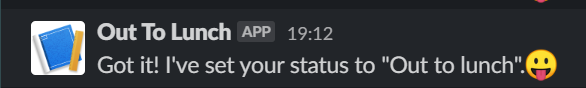
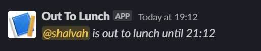

# Out For Lunch
Simple Slack slash command to let team members know you're away at lunch.

## Usage
Assuming the registered slash command is `/lunch`, typing `/lunch for 2 hours` in Slack will:
1. Set your status to "Lunch", and set it to clear after 2 hours
2. Post a message in a specified channel (#deimos, in our case) letting others know that you've gone to lunch.

<p align="center">



</p>

## Tech stack and design
This service is deployed as a set of Google Cloud Functions (via the [Serverless Framework](http://serverless.com)) with HTTP triggers. For data storage (storing users' access tokens), I'm using a simple solution—a Google Sheet, turned into an API via [Sheety](http://sheety.co).

The slashCommand `function` is the actual endpoint called by Slack when someone uses the command. The other functions, `install` and `completeInstall` are convenience URLs for users to authorize via OAuth (Sign in With Slack).

## Setting up
1. Install the Serverless Framework: `npm i -g serverless`

2. Install dependencies: `npm i`

3. Copy the .env.example file to .env. Fill in the needed values.
  - For the SLACK_* variables, yo'll need a Slack app with an incoming webhook to the channel of your choice set up. For testing purposes, you can use the #slack-app-testing chanel.
  - For the SHEETY_* variables, you can create a Google Sheet in the right format by cloning [this one](https://docs.google.com/spreadsheets/d/1cty8Bnyqd2Swgq929xvd8ZB3qKBb77JjJe7XDWcDffE/edit?usp=sharing). Then sign up on http://sheety.co, connect your sheet, enable GET and POST endpoints, and set a bearer token. 

4. Ensure you have a Google service account with the following roles:
  - Cloud Functions Developer
  - Deployment Manager Editor
  - Logging Admin
  - Storage Admin

  Download a JSON key file for this account and place it in the root of the project as keyfile.json. See https://serverless.com/framework/docs/providers/google/guide/credentials/.

## Deploying
### Deploying a new service
If you're starting from scratch (ie not updating an existing function), run `serverless deploy` to deploy.

### Updating an existing function
Normally to update an already deployed serverless function, you run `serverless deploy`. But the Google Cloud Functions provider seems to be buggy, so I've found that what works is deleting the functions and creating them afresh:

```
serverless remove; serverless deploy
```

The deployed URL remains the same.

## Important notes
1. After deploying a new function (or deleting and recreating), you need to set your cloud function to be accessible on the public internet. Currently, the Serverless Framework doesn't currently support setting this, so you'll have to do this manually *_each time_*, either [via the Cloud Console](https://cloud.google.com/functions/docs/securing/managing-access-iam#allowing_unauthenticated_function_invocation), or by using `gcloud` (make sure the correct project ID is used):
```
gcloud beta functions add-iam-policy-binding out-to-lunch-dev-slashCommand --region=us-central1 --member=allUsers --role=roles/cloudfunctions.invoker --project=observability-253118
gcloud beta functions add-iam-policy-binding out-to-lunch-dev-install --region=us-central1 --member=allUsers --role=roles/cloudfunctions.invoker --project=observability-253118
gcloud beta functions add-iam-policy-binding out-to-lunch-dev-completeInstall --region=us-central1 --member=allUsers --role=roles/cloudfunctions.invoker --project=observability-253118
```

## Local testing
I haven't really optimized this for local testing yet.
